**Streaming Media Web Server**

- 一款极简的流媒体Web服务器，提供视频音乐的在线播放功能
- A extremely simple web server of streaming media, which can provide online play of video and audio

**项目背景**

- 在硬盘上的高清电影，难道就只能在电脑上才能看吗？我想在手机上看行不行呢？

- 类似NAS（Network Attached Storage，网络附属存储）一样，搭建一个局域网私有视频云服务器
- 本项目的核心目的是做一个类似于**视频NAS**，可以**在局域网下提供视频音乐、在线观看服务**

 **市场上已有的局域网流媒体播放器平台**

- flex：收费

- jellyfin：免费；坑多，可用性较差

- emby：收费；可用性还行


**Features**

- 以文件夹为单位，递归**收集**指定目录下的**所有文件**
- 虽然可收集所有类型的文件，但目前只可以**在线观看视频、音乐**，其他类型文件赞不支在线观看
- 视频**文件的两种预览模式**
  - 列表模式：依次展示每个文件夹下的所有文件
  - 宫格模式：以384px * 216px（是1920*1080的同比缩放）的格式展示视频、音乐文件
- 文件管理：**文件删除、文件重命名**

# 快速预览
**列表模式**
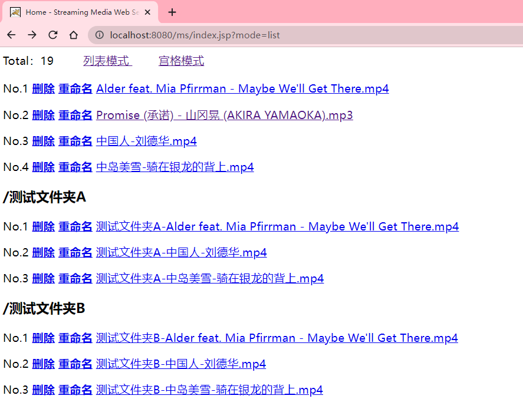

**在列表模式下删除文件**
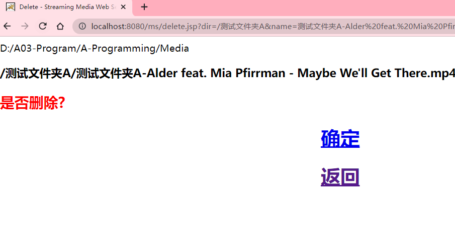

**列表模式下重命名文件**
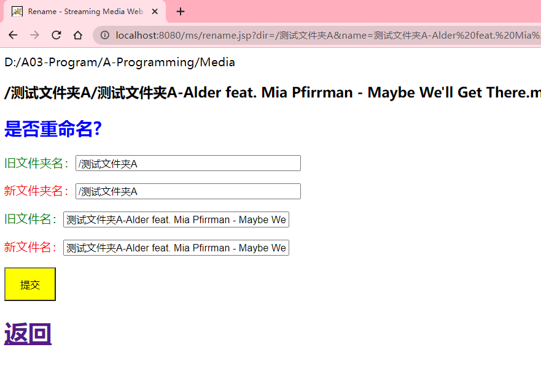

**宫格模式**
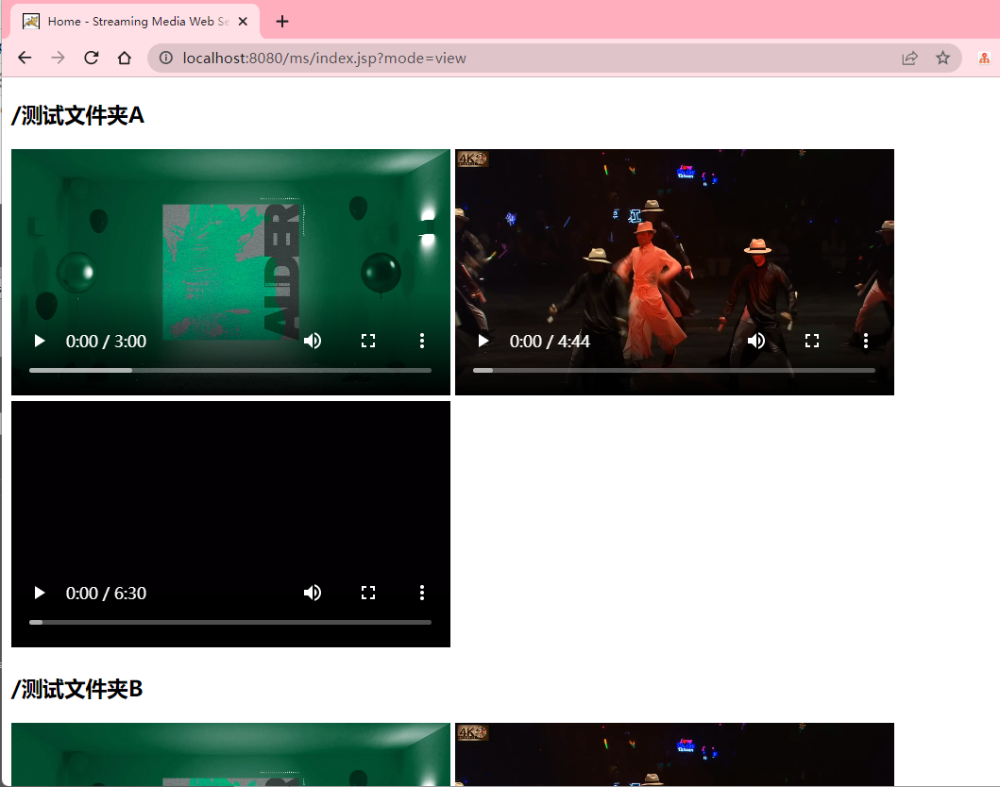

**宫格模式下的实时播放**
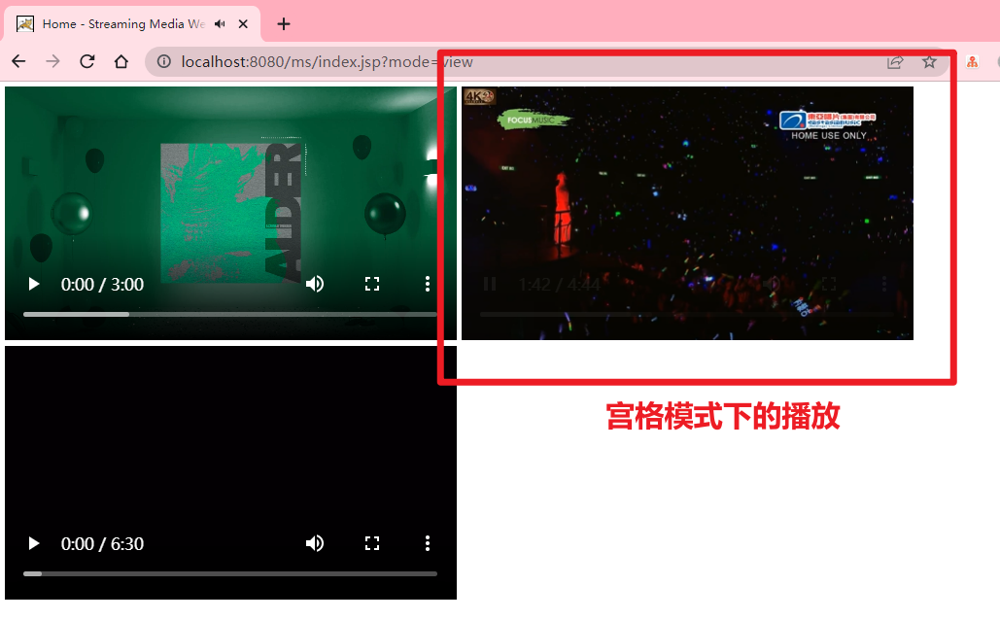

# 环境检查与配置

**主要步骤**

1. 设置系统编码
2. 安装Java以及配置环境变量
3. 安装以及配置Tomcat

## 设置系统编码

**前言：Windows环境无需配置此项**

**检查Linux系统编码环境：**

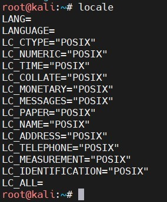

**为什么要检查系统编码：使得支持中文，可以正常显示中文的视频文件，以及解析URL中的中文**

**修改为UTF-8：**

进入在root目录，在.bashrc和.profile文件中追加以下数据：

export LC_ALL=en_US.UTF-8

export LANG=en_US.UTF-8

export LANGUAGE=en_US.UTF-8

 使生效：

source .bashrc

source .profile

 再检查：

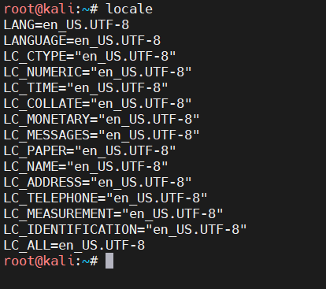

## Java环境

这里以**aarch64的树莓派**为例，演示安装过程。其他Linux和Windows平台同理。

**查看系统平台：uname -a**

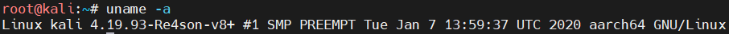

**根据平台下载JDK：**

https://www.oracle.com/technetwork/java/javase/downloads/jdk8-downloads-2133151.html

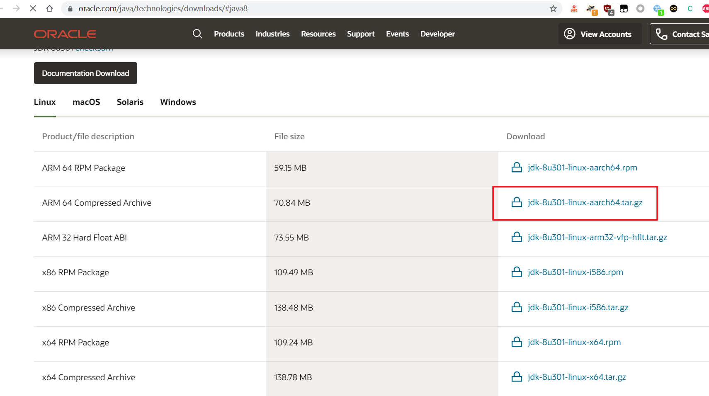

**上传解压：**

- 在opt目录下创建Java文件夹，专门存放jdk数据：/opt/java

- 将jdk数据包上传并解压：tar -zxvf jdk-8u301-linux-aarch64.tar.gz

> 注意：usr存放的是系统自带的程序数据包，opt存放的是用户的数据包。

**添加环境变量：**

- 编辑：vim /etc/profile

- 追加以下数据：

```sh
export JAVA_HOME=/opt/jdk1.8.0_301
export PATH=$JAVA_HOME/bin/:$PATH
export CLASSPATH=.:$JAVA_HOME/lib/dt.jar:$JAVA_HOME/lib/tools.jar
```

- 使得配置的环境变量立即生效：source /etc/profile

- 查看是否配置成功：java -version

## 下载Tomcat

**下载：https://tomcat.apache.org/download-90.cgi**

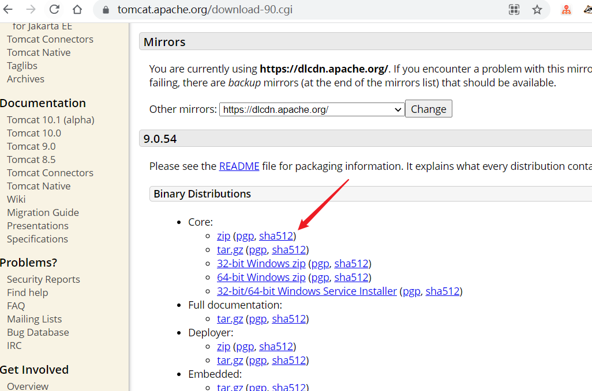

**上传解压：**

- 在opt目录下创建Tomcat文件夹，专门存放jdk数据：/opt/tomcat

- 将jdk数据包上传并解压：tar -zxvf apache-tomcat-9.0.54.tar.gz

- 解压后将文件夹名字改短一点，方便以后使用：mv apache-tomcat-9.0.54 tomcat9

 **修改配置文件conf/server.xml，自定义端口和URI编码为UTF-8：**

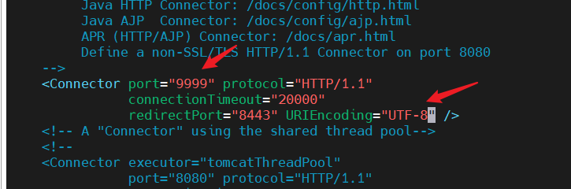


## 配置Tomcat

**在Tomcat安装目录下的conf/server.xml中指定静态资源的目录，以及解析地址**

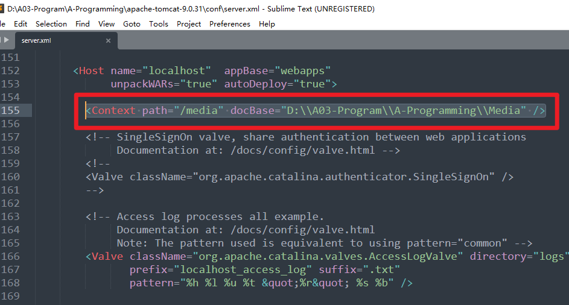

> 凡是以/media开头的请求，全部都会解析到docBase指定的目录下

**docBase** 指定的目录是视频文件的存放地点


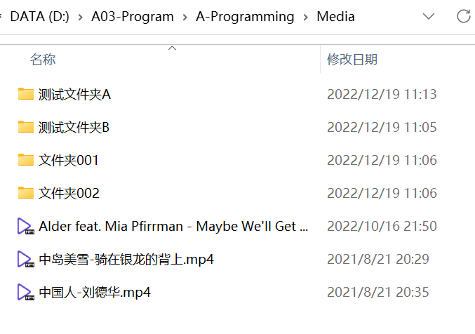

# 部署

1. 下载源码包：https://github.com/HackyleShawe/StreamingMediaWebServer
2. 将其解压，重命名为一个简单的名字，我重命名为：ms，意为Media Server
3. 复制ms到到%Tomcat%/webapps/
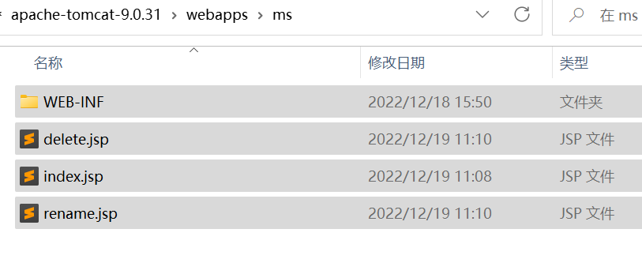
4. 编辑Tomcat的配置文件（conf/server.xml），指定静态资源文件的映射地址与资源目录。目的是让请求解析到对应目录下的视频资源文件

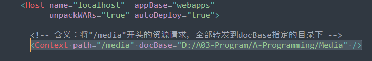

5. 编辑项目配置文件：WEB-INF/config.properties文件，指定媒体资源的目录。目的是让本应用程序找到媒体资源的位置
   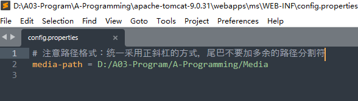

> 注意格式：Linux、Windows平台都使用正斜杠的方式

6. 启动Tomcat，指定%Tomcat%/bin/shartup.bat

7. 访问项目：http://localhost:8080/ms/
   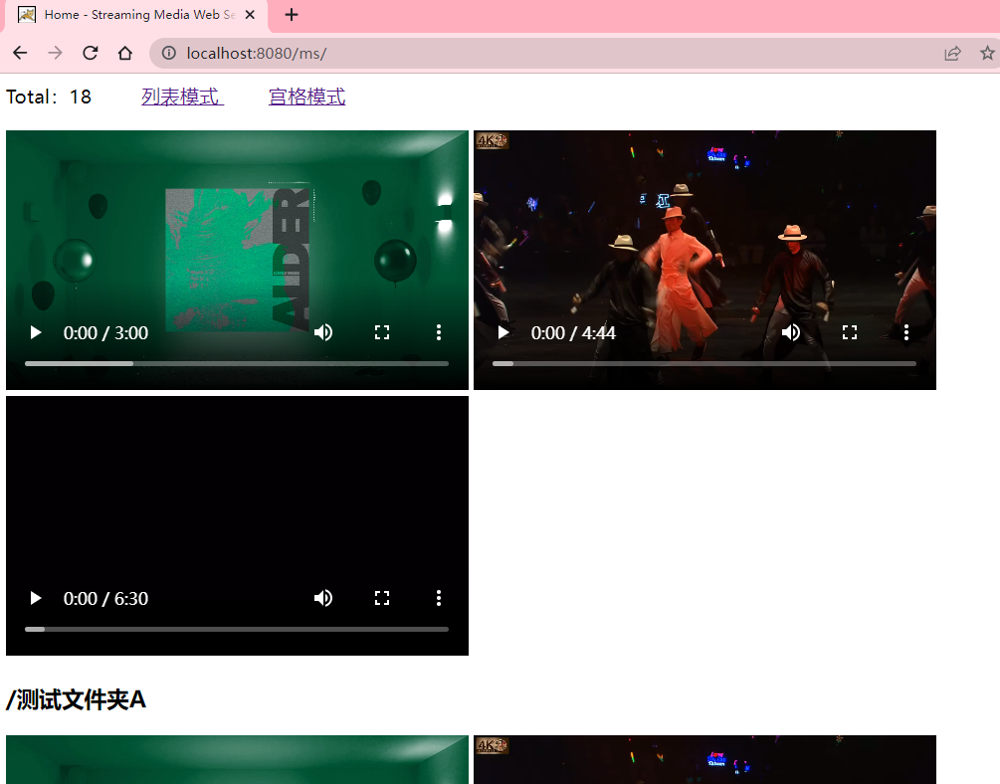

> 首次访问示意图

# 代码设计

**设计思想**

1. 创建一个专门存放视频文件的目录，例如：D:\A03-Program\A-Programming\Media
2. 配置Tomcat将所有的静态资源请求全部解析到该个文件夹下
3. 写一个JSP来读取该目录下的所有媒体文件
4. 点击媒体文件后，经过Tomcat就解析到了媒体文件的真实路径

**index.jsp功能**

- 读取配置文件中指定路径下的所有视频文件，以文件夹为单位暂存
- 两种呈现方式：列表、宫格

**delete.jsp功能：** 删除文件：调用java.util.File的delete方法

**rename.jsp功能：** 重命名文件：调用java.util.File的renameTo方法

